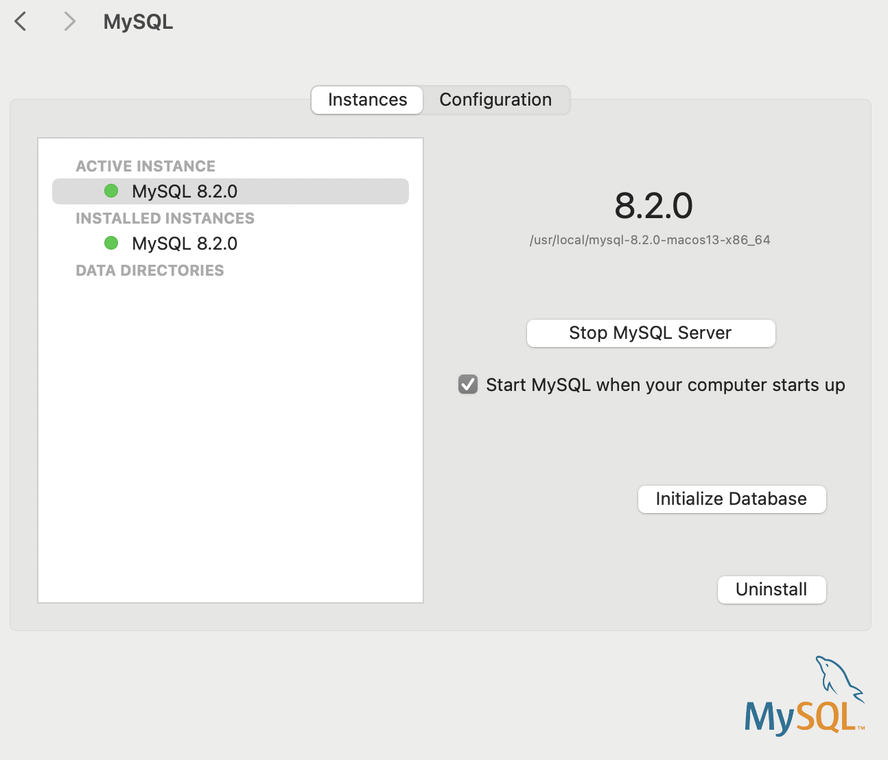

# DIENNEA exercise

## General instructions
You have to provide full source code, published on a GitHub public repository or
sent via email.\
The project MUST use Maven as project model, other project models (like Gradle,
ANT, Eclipse built-in) will not be accepted.\
The project MUST contain all files needed for configuration, usually it is better to
have a README.txt file which explains the project and the configuration. Usually the
configuration will reside in a src/main/resources/configuration.properties file (but
this is not required).
## DB Benchmarks
You have to implement simple java application which executes benchmarks on a
JDBC compliant database.\
The application MUST evaluate the min/max/avg time of INSERT statements.\
The application MUST evaluate the min/max/avg time of SELECT statements (using
the PK of the COLUMN).\
The application MUST issue DML requests using the PreparedStatement API and
issuing “commits” every X statements.\
The application will be run on a MySQL Database.\
The script to create the table MUST be included in the source code.

### Configuration

> - S.O used : MacOS Sonoma v. 14.1.1\
> - IntelliJ
> - mySQL v 8.2.0

1. Install mySQL Client https://dev.mysql.com/downloads/mysql/ \
   `user:root`\
   `pswd: [provided via mail]`\
Open the System Preferences and start the Server:\



2. Open the terminal and move to the path 'Base Directory' (default : `/usr/local/mysql`).\
   Eseguire i seguenti comandi: :\
   ```
   >cd /usr/local/mysql/bin/mysql
   >/usr/local/mysql/bin/mysql -u root -p
   >CREATE DATABASE DIENNEA;
   ```
   to verify that the DIENNEA DB has actually been created use:  \
   `show databases;`\
   to use the DIENNEA DB, always from the command line:  \
   `use DIENNEA`
3. Open the preferred IDE IDE and create a new one Maven project
4. Add the Maven dependency to the file pom.xml that should download the source:
   ```
   <dependency>
      <groupId>mysql</groupId>
      <artifactId>mysql-connector-java</artifactId>
      <version>8.0.27</version>
   </dependency>
   ```
### Developing

 - PropertyManager : handle the reading of configuration.properties file and ready the key
 - JDBCBenchmark : this class handle the connection to the DB and run the requested query with the calculation of Benchmarks.
 - Main: this class create the table, if it doesn't already exist, perform the insert and the selection.
